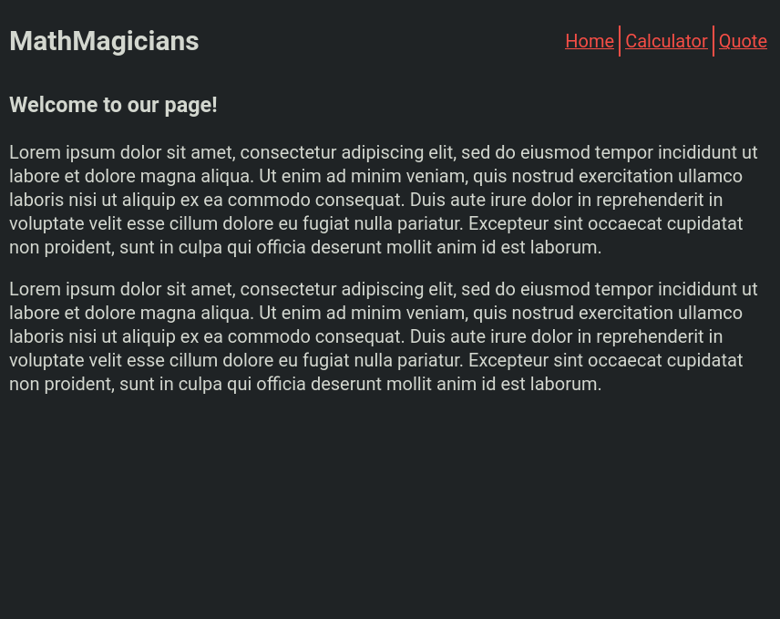

# MathMagicians

> A web calculator app.

## Built With

- HTML, JavaScript, CSS
- Webpack, React, Jest

## Live Demo

[Todo List Demo](https://github.com/mistermaxis/MathMagicians)

## Getting Started

To get a local copy up and running follow these simple example steps.

### Usage

Clone the repository and open `index.html` from the `dist` folder in a browser.

## Authors

👤 **Maximiliano Diaz**

- GitHub: [@mistermaxis](https://github.com/mistermaxis)
- LinkedIn: [Maximiliano Diaz](https://linkedin.com/in/mistermaxis)

## 🤝 Contributing

Contributions, issues, and feature requests are welcome!

Feel free to check the [issues page](../../issues/).

## Show your support

Give a ⭐️ if you like this project!

## Acknowledgments

- Hat tip to anyone whose code was used
- Inspiration
- etc

## 📝 License

This project is [MIT](./MIT.md) licensed.
